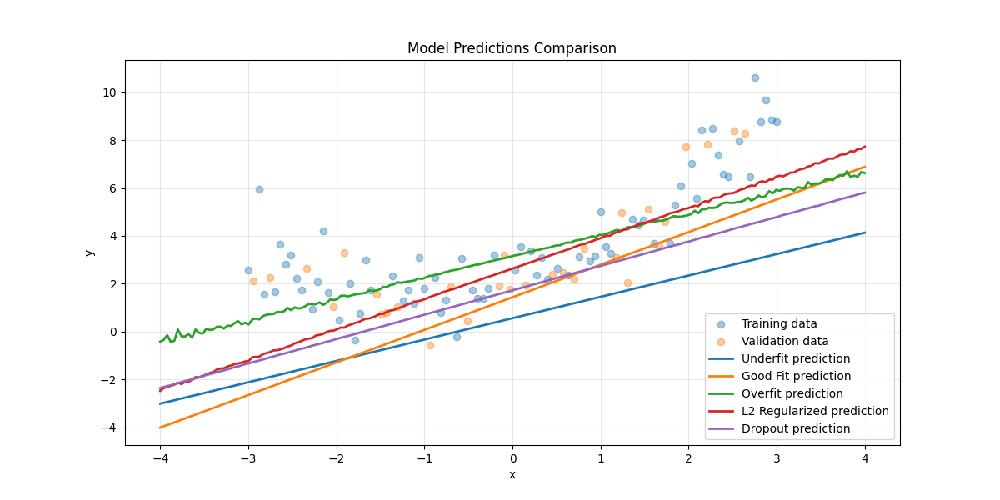
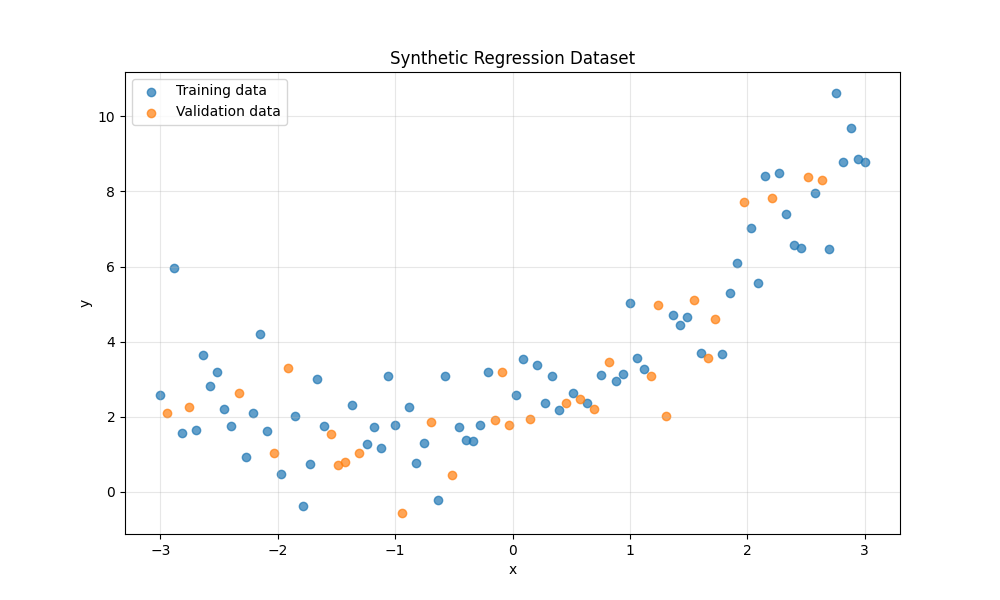
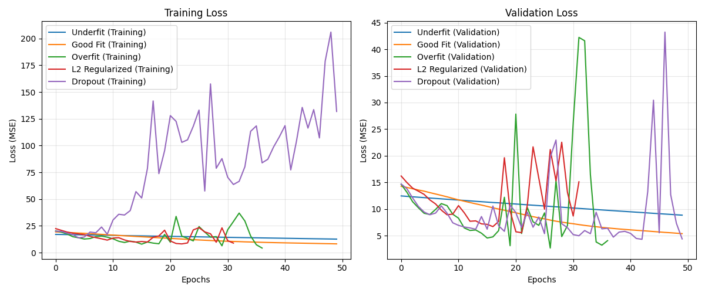

# regularisation-effects
This repo contains scripts demonstrating the role of regularisation in preventing overfitting and improving generalisation in machine learning models.

## setup

```bash
# Create a virtual environment
python -m venv venv

# Activate the environment
# On Windows:
venv\Scripts\activate
# On macOS/Linux:
source venv/bin/activate

# Install dependencies
pip install -r requirements.txt
```

## 📚 Overview

Through hands-on code examples, this repository demonstrates:

- The optimization-generalization tradeoff
- Underfitting and overfitting phenomena
- Model evaluation techniques
- Regularization methods
- The importance of proper data handling

Each script provides practical implementations of concepts that are essential to understand when building effective machine learning models.

## 🗂️ Repository Contents

This repository contains three main Python scripts:

### 1. `ml-fundamentals.py`

Demonstrates the fundamental concepts of underfitting, overfitting, and regularization using synthetic data.

**Key features:**
- Creates a synthetic regression dataset
- Implements models with different capacities
- Shows the effects of L2 regularization and dropout
- Visualizes learning curves and model predictions
- Demonstrates the transition from underfitting to overfitting

### 2. `cross-validation-demo.py`

Explores different validation techniques for reliable model evaluation.

**Key features:**
- Implements simple holdout validation
- Demonstrates K-fold cross-validation
- Shows iterated K-fold validation with shuffling
- Visualizes performance across different folds
- Uses scikit-learn's KFold with Keras models

### 3. `regularization-techniques.py`

Deep-dive into various regularization methods using the California Housing dataset.

**Key features:**
- Implements L1, L2, and combined L1+L2 regularization
- Demonstrates dropout regularization
- Shows early stopping implementation
- Explores the relationship between model capacity and regularization
- Compares different regularization techniques

## 🧪 Experiment Results and Analysis

The following results demonstrate the core concepts of underfitting, overfitting, and regularization using a synthetic regression dataset.

### Synthetic Dataset

The experiment uses a synthetic quadratic dataset with added noise (y = 0.5x² + x + 2 + random noise):



This dataset is split into training data (blue) and validation data (orange) to evaluate model performance on unseen data.

### Learning Curves Analysis

The learning curves show how different models perform during training:



**Observations:**

- **Underfit Model (Blue)**: 
  - Shows high, slowly decreasing loss on both training and validation
  - The model is too simple to capture the underlying quadratic pattern

- **Good Fit Model (Orange)**:
  - Gradual and steady decrease in both training and validation loss
  - Maintains a good balance without significant divergence

- **Overfit Model (Green)**:
  - Rapidly decreasing training loss
  - Highly unstable validation loss with extreme spikes (reaching ~42)
  - Classic overfitting behavior: performs well on training data but poorly on new data

- **L2 Regularized Model (Red)**:
  - More stable than the overfitting model but still shows some validation spikes
  - Regularization helps control the model's tendency to overfit

- **Dropout Model (Purple)**:
  - Extremely volatile training loss (reaching ~200) which is normal for dropout
  - This happens because different neurons are randomly deactivated each batch
  - Despite high training loss, validation loss eventually reaches a lower value than other models

### Model Predictions Comparison

This visualization shows how each model fits the underlying pattern:



**Observations:**

- **Underfit Model (Blue line)**: 
  - Predicts a simple linear relationship
  - Can't capture the quadratic nature of the data

- **Good Fit Model (Orange line)**:
  - Better captures the curvature but still somewhat linear

- **Overfit Model (Green line)**:
  - Shows some waviness, especially at lower x values
  - Signs it's capturing noise rather than just the underlying pattern

- **L2 Regularized Model (Red line)**:
  - Smoother than the overfitting model while still capturing the quadratic trend

- **Dropout Regularized Model (Purple line)**:
  - Most conservative fit with the smoothest curve
  - Prevents fitting to noise while still capturing the overall trend

### Key Insights

1. **Underfitting**: The simple model (blue) lacks the capacity to learn the quadratic relationship, resulting in high error for both training and validation data.

2. **Good Fitting**: The intermediate model (orange) balances complexity and generalization, capturing the trend without excessive detail.

3. **Overfitting**: The complex model (green) fits the training data extremely well but shows erratic behavior on validation data, indicating it's memorizing noise rather than learning the true pattern.

4. **Regularization Effectiveness**: 
   - L2 regularization (red) constrains weight values, producing a smoother fit
   - Dropout (purple) randomly disables neurons during training, forcing the model to be more robust and preventing co-adaptation

5. **GPU Acceleration**: The experiment successfully utilized the M1 Mac's GPU through Metal acceleration:
   - First epoch of each model typically took 1.9-3.7 seconds (includes compilation time)
   - Subsequent epochs ran much faster at ~0.1-0.13 seconds each
   - Total experiment completed in under 40 seconds

## 🔧 Setup and Requirements

### Prerequisites:
- Python 3.7+
- TensorFlow 2.x
- NumPy
- Matplotlib
- scikit-learn

### Installation:

```bash
# Clone the repository
git clone https://github.com/yourusername/machine-learning-fundamentals.git
cd machine-learning-fundamentals

# Create a virtual environment (optional but recommended)
python -m venv venv
source venv/bin/activate  # On Windows: venv\Scripts\activate

# Install dependencies
pip install tensorflow numpy matplotlib scikit-learn
```

### GPU Acceleration (Apple Silicon Macs):

For M1/M2 Macs, install the following for GPU acceleration:

```bash
pip install tensorflow==2.9.0
pip install tensorflow-metal==0.5.0
```
